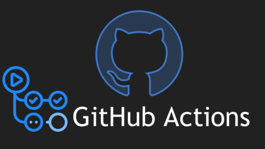
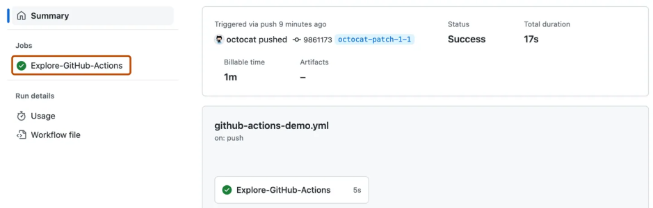

# Introduction to GitHub Actions

<kbd></kbd>

## What is GitHub Actions?

GitHub Actions is a **Continuous Integration and Continuous Delivery (CI/CD)** platform that is built directly into GitHub.
It allows you to **automate tasks** such as:

* Running tests when you push code
* Building and packaging applications
* Deploying code after a pull request is merged
* Running scripts when issues or pull requests are created

Instead of doing these steps manually, you can define a set of instructions in a **workflow file** (`.github/workflows/<filename>.yml`) and GitHub will run them automatically whenever certain events occur in your repository.

For example you can configure a workflow so that every time code is pushed to the `main` branch, the following happens automatically:

- Run all unit tests.
- Build the application.
- Deploy it to a test server.

This means developers spend less time on repetitive tasks and more time on coding.

<kbd></kbd>

---

## Why use GitHub Actions?

There are many automation platforms out there:

GitHub Actions is popular because:

- **It’s built directly into GitHub** - No extra setup or external service is required. Workflows live alongside your code in the repo.
- **Huge Marketplace of actions** - Thousands of prebuilt actions created by GitHub and the community simplifying harder tasks.
- **Multi-platform support** - GitHub provides Linux, Windows, and macOS virtual machines out of the box. You can also run on your own servers or cloud VMs.
- **Not just for DevOps** - Workflows don’t need to be limited to build/test/deploy. Examples:
  - Auto-label new issues based on keywords.
  - Send notifications when a PR is merged.
  - Run scheduled jobs (e.g., nightly reports).

Basically automate anything in your repo, anything you can do on GitHub, anything you can do in your terminal, and anything you want your code to do on a server.

<kbd></kbd>

---

## Quickstart Options

If you’re new to GitHub Actions, there are easy entry points:

- **[GitHub Actions Docs](https://docs.github.com/en/actions)** - GitHub provides a full documentation library for GitHub Actions. This covers all the concepts, has in depth how-tos, and even full tutorials.
- **[Starter Workflows](https://github.com/actions/starter-workflows)** - GitHub provides a library of workflow templates in the `actions/starter-workflows` repo. These cover common use cases like building Node.js, Python, .NET, or deploying to GitHub Pages. You can also access these when creating a new workflow through GitHub which we will do later.
- **[GitHub Actions Cheatsheet](https://github.github.io/actions-cheat-sheet/actions-cheat-sheet.pdf)** - GitHub's own cheatsheet for GitHub Actions.