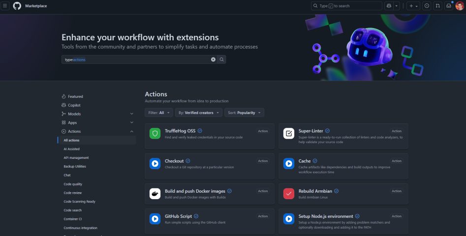
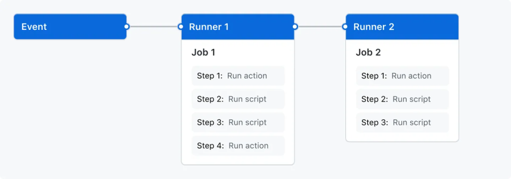

# Key Terms & Anatomy of GitHub Actions

Before we start building workflows, it’s important to understand the **core terms of the building blocks** for GitHub Actions.  
These terms will come up often, and knowing how they fit together will make it much easier to grasp using workflows.

---

## YAML

<kbd></kbd>

YAML (short for YAML Ain’t Markup Language) is a configuration language that is used for GitHub Actions.  
It's similar to XML or JSON, which you might already be familiar with.  

- Everything is structured into 2 differet pieces:
  - **property**: `key: value`
  - **list item**: `- item`
- YAML uses **indentation** to define structure. **Spaces are very significant, all items at the same level must align.**
- **[ ]** can be used for inline arrays, **{ }** for inline key-value maps.
- For workflows (and pipelines in other repositories) it supports **expressions** using `${{ }}` for variables and conditional logic.

Here is an example between JSON and YAML:  
Simple JSON structure:
```
{
  Servers: [
    {
    name: "Server1",
    owner: "John",
    created: 2022,
    status: "active"
    }
  ]
}
```

Simple YAML structure:
```yaml
Servers:
  - name: Server1
    owner: John
    created: 2022
    status: active
```

For further examples and help here is a [YAML cheatsheet](https://quickref.me/yaml).

---

## Steps

- A **step** is a single task within a job.
- Steps run in order from top to bottom.
- Steps can run a shell command (`run:`), or use a prebuilt action (`uses:`)

```yaml
steps:
  - run: echo "Hello World"
  - uses: actions/checkout@v4
```

Here, one step echoes text, and the next step uses the official `checkout` action to get your repo’s code.  
Shell commands are based on the runner, Linux runners will use Bash, Windows runners will use PowerShell.  

### Action

- An **action** is a reusable unit of code that performs a specific task.
- The GitHub Marketplace holds thousands of actions to select from.
- Actions have additional variables/arguments that can be used to adjust how they function.
- You can create your own actions.

<kbd></kbd>

Some examples:
- `actions/checkout` - clone your repo code
- `actions/setup-node` - install Node.js
- `docker/login-action` - log in to Docker registry

These actions will also need to have a version when specifying them, `actions/checkout@v5.0.0`.  
This allows you to use specific versions of actions even for legacy code/workflows.

For further examples and help see the [Understanding - actions](https://docs.github.com/en/actions/get-started/understand-github-actions#actions) and [GitHub Actions - Find and Customize Actions Page](https://docs.github.com/en/actions/how-tos/write-workflows/choose-what-workflows-do/find-and-customize-actions)

---

## Runner

- A **runner** is the machine that executes jobs.
- There are **GitHub-hosted runners** which are provided by GitHub (Linux, Windows, macOS), or **Self-hosted runners** you can set up on your own machines.

Example in workflow:

```yaml
runs-on: ubuntu-latest
steps:
  - run: echo "Building the app"
```

This tells GitHub to use a cloud hosted Linux VM from GitHub.
There are several available cloud runners, or you can set up your own self-hosted runner.  
Check the GitHub docs on [Understanding - runners](https://docs.github.com/en/actions/get-started/understand-github-actions#runners) and [Choosing the runner for a job](https://docs.github.com/en/actions/how-tos/write-workflows/choose-where-workflows-run/choose-the-runner-for-a-job)

---

## Job

- A **job** is a group of steps that run together on the **same runner**.
- Jobs are defined under the `jobs:` section in a workflow.
- Jobs can run in parallel or depend on each other using `needs:`.

Example:

```yaml
jobs:
  build:
    runs-on: ubuntu-latest
    steps:
      - run: echo "Building the app"
  test:
    runs-on: ubuntu-latest
    needs: build
    steps:
      - run: echo "Running tests"
```

Here, we have created 2 jobs, `test` and `build`. The `test` job will only run after `build` finishes successfully as we have also added the `needs:` configuration.
Check the GitHub docs on [Understanding - jobs](https://docs.github.com/en/actions/get-started/understand-github-actions#jobs) and [Using jobs in a workflow](https://docs.github.com/en/actions/how-tos/write-workflows/choose-what-workflows-do/use-jobs)

---

## Workflow

- A **workflow** is the top-level automation definition in GitHub Actions.
- It lives inside your repository under the folder:

  ```
  .github/workflows/
  ```
  ```
  ./
  ├── .git/
  ├── .github/
  │ └── workflows/
  │   └── ci.yml
  ├── <Other Project Files>
  └── README.md
  ```

- Each workflow is written in **YAML** and describes (*.yml or *.yaml):
  - When to run (the **event** or **trigger** that starts it)
  - What to run (the **jobs** and **steps** configures within)

The `ci.yml` could define that every push to `main` should build and test your project.  

Check the GitHub docs on [Understanding - workflows](https://docs.github.com/en/actions/get-started/understand-github-actions#workflows)  

There are many different ways to go about [Triggering a workflow](https://docs.github.com/en/actions/how-tos/write-workflows/choose-when-workflows-run/trigger-a-workflow)

---

## Putting It All Together – Workflow Anatomy

<kbd></kbd>

Here’s a minimal workflow file showing all the pieces:

```yaml
name: CI Example                      # Workflow name

on: [push, pull_request]              # Trigger: run on push or PR

jobs:
  build:                              # Job name
    runs-on: ubuntu-latest            # Runner
    steps:                            # Steps in this job
      - uses: actions/checkout@v4     # Action
      - run: echo "Building project"  # Shell command
```

This workflow does the following:
- Trigger: runs when you push or open a PR.
- Job: called `build`, runs on a GitHub cloud hosted Linux runner.
- Steps: check out the code, then run a shell command.
