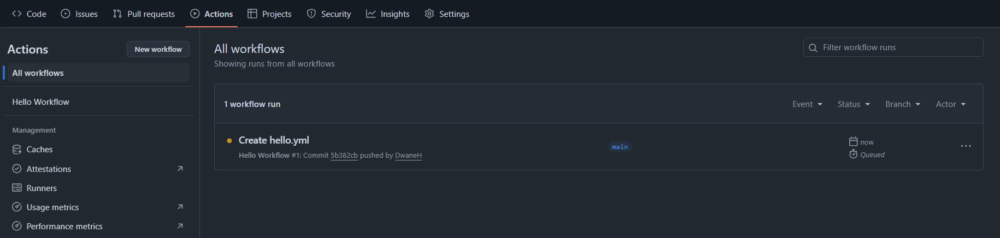
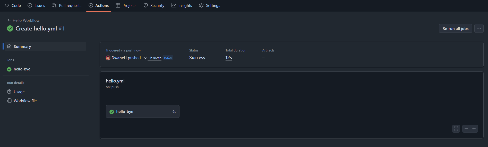
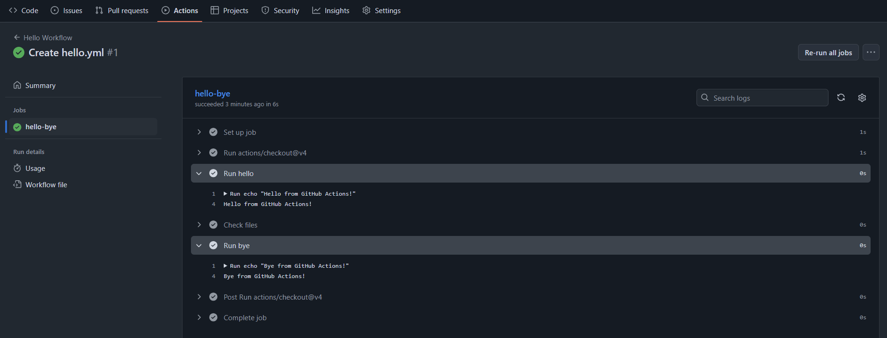

# Warm-Up Exercise: Hello Workflow

Now that you understand the terms and anatomy of GitHub Actions, let’s look at a simple starter workflow together.  
This exercise will help you see a workflow in action, and understand how triggers, jobs, steps, and actions work.

<kbd></kbd>

---

## The Workflow File

There is already a workflow file in this repository at:

```
.github/workflows/hello.yml
```

Copy this yaml and update the empty workflow file:
```yaml
name: Hello Workflow

on:
  push: {}

jobs:
  hello-bye:
    runs-on: ubuntu-latest
    steps:
      - uses: actions/checkout@v4
      - name: Run hello
        run: echo "Hello from GitHub Actions!"
      - name: Check files
        run: |
          pwd
          ls -a
      - name: Run bye
        run: echo "Bye from GitHub Actions!"
```

---

## Understanding the Workflow

1. **`name: Hello Workflow`**
  - The display name for this workflow (you’ll see it in the Actions tab in GitHub).

2. **`on: push`**
  - This trigger means the workflow will run whenever you **push code** to the repository.
  - I have expanded on the default `on: [push]` so that later, we can refine this to only run on certain branches.

3. **`jobs: hello-bye`**
  - A single job named `hello-bye`.
  - Runs on the latest Ubuntu virtual machine (`runs-on: ubuntu-latest`).

4. **`steps`**
  - The job has a series of steps:
    - `actions/checkout@v4` - pulls down your repository code so later steps can use it.
    - `Run hello` - prints a hello message.
    - `Check files` - shows the current directory (`pwd`) and lists all files (`ls -a`), using an **inline** step.
    - `Run bye` - prints a goodbye message.

---

## Running the Workflow

1. Commit and push the updated `hello.yml` workflow to your repository.
2. Go to your repo’s **Actions tab** on GitHub.
3. You should see **“Hello Workflow”** appear and run.
<kbd></kbd>

4. Open the workflow logs and check the output of each step.
<kbd></kbd>

5. You should see “Hello from GitHub Actions!”, a file listing, and then “Bye from GitHub Actions!”.
<kbd></kbd>

---

This is just a **hello world** style workflow, but it introduces the most important concepts.  
Let's expand this into a real-world CI workflow with build and test steps.
