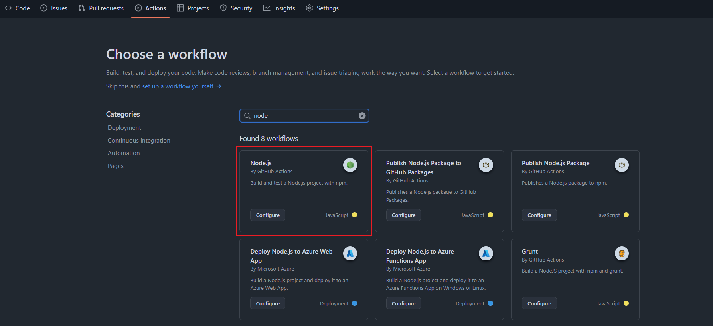
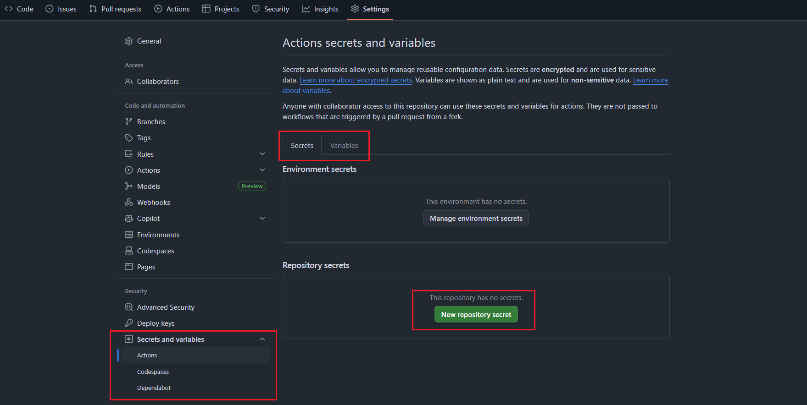

# Main Exercise: Node.js Project CI

Now that you’ve created a simple “Hello Workflow”, let’s move on to a real-world example.  
We’ll set up a CI workflow for a Node.js project.

---

### Step 1: See the Node Project

- This repo also contains a small Node.js project with dependencies and tests.

Make sure you can see a `package.json` file in the project.

### Step 2: Create a New Workflow Using GitHub’s Template

1. Go to the **Actions tab** in your repo.
2. Select **New workflow** at the top left.
3. Search for and choose the **Node.js template**.
<kbd></kbd>

4. This will create a workflow file like the one below:

```yaml
name: Node.js CI

on:
  push:
    branches: [ "main" ]
  pull_request:
    branches: [ "main" ]

jobs:
  build:
    runs-on: ubuntu-latest

    strategy:
      matrix:
        node-version: [18.x, 20.x, 22.x]

    steps:
      - uses: actions/checkout@v4
      - name: Use Node.js ${{ matrix.node-version }}
        uses: actions/setup-node@v4
        with:
          node-version: ${{ matrix.node-version }}
          cache: 'npm'
      - run: npm ci
      - run: npm run build --if-present
      - run: npm test
```

### Step 3: Understanding the Workflow

- **Trigger (`on`)**
  - Runs on push or pull request events targeting the `main` branch.

- **Matrix Strategy**
  - This is an advanced piece that runs the same job on 3 versions of Node.js (`18.x`, `20.x`, `22.x`).

- **Steps**
  - `checkout` - pull the repository code.
  - `setup-node` - install the correct Node.js version on the runner.
    - Note that actions can be customised by using additional settings in their `with:` portion.
    - Always check each action to see what customisation you need.
  - `npm ci` - clean install of dependencies.
  - `npm run build` - build only if defined in `package.json`.
  - `npm test` - runs the project’s test suite.

### Step 4: Adjusting the Workflow

Let’s make a few changes:

1. Change the `push` trigger to run on the `nodeproject` branch instead of `main`. `pull_request` can stay as `main` branch.
2. Add a custom echo step after tests to let us know it completed successfully and which version it was running.
3. Click "Commit change...", in the commit pop up create a new branch `nodeproject` and then finish by selecting "Propose changes".

### Step 5: Run & Observe

1. Since this is already within the remote the `on: push` should trigger the workflow.
2. Leave the creation of the PR and swap to the **Actions tab** and watch:
   - The matrix builds (multiple Node.js versions).
   - Steps running in sequence.
   - Output logs from build and test steps.

---

## Variables & Secrets

Let’s add some usage of variables and secrets so we can get an idea of how they can be used within pipelines:

1. Head to your repository **Settings tab**, then under **Secrets and variables** select **Actions**.
<kbd></kbd>

2. In here you can create secret variables to store specific items safely, and in the variables tab you can store plain text variables.
3. Create a new repository secret and a new repository variable, and remember the names.
4. Add a custom inline run step after all the others that simply echoes out your secret and variable.
  - We can use expressions `${{ }}` to use the variables.
   ```yaml
   ...
         - run: npm test
         - run: |
             echo "${{ secrets.<secret_name> }}"
             echo "${{ vars.<variable_name> }}"
   ```
5. Commit the change to the workflow, push the commit (or just use the UI), and watch the new run.
6. See how the secret comes out as "***", and the plain text variable does transform.
7. We can also create environment variables within the workflow/job/step.
8. Above the `jobs:`, add an environment variable and then add an echo step to test out.
   ```yaml
   ...
     pull_request:
       branches: [ "nodeproject" ]

   env:
     GREET_NAME: World

   jobs:
   ...
         - run: |
             echo "Hello ${{ env.GREET_NAME }}, you have a variable: ${{ vars.<variable_name> }}, and a secret: ${{ secrets.<secret_name> }}"
   ```

- These were simple echos but this is to give you an understanding of variables, these can be used anywhere within the workflow.

---

## Key Takeaways

- The **Github workflow templates** give great setups out of the box for a multitude of projects.
- **Matrix builds** are a powerful way to ensure code runs across dependencies or environments.
- Workflows can be **customised** (triggers, steps, extra jobs, variables).
- The **Actions tab** provides detailed logs and insights into each run.
