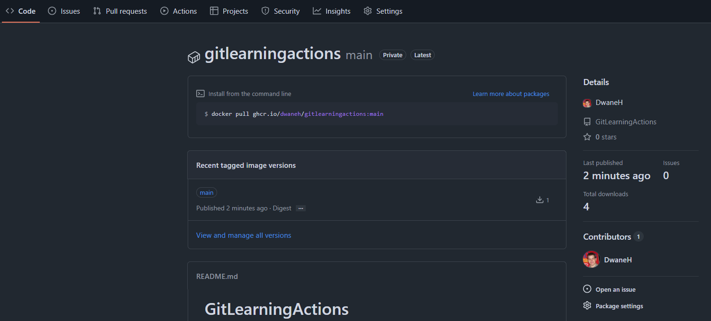

# Wrap-Up

## What We Learned

- GitHub Actions lets you automate directly inside your repo.
- **Workflows** define your automation blueprints.
  - You can have as many workflows as you want.
- **Jobs** run in sequence or parallel.
  - Remember to structure these with `needs: <job_name>`.
- **Steps** are the individual commands or actions.
  - Make sure to select the correct type of action or shell command (inline or single command) for your specific needs.

---

## Tips when Starting with Workflows/Pipelines

- **What would you automate first?**
  - Testing and linting, as they provide fast feedback and improve code reliability.
  - Move on to artifacts for binaries or logs.

- **How does this compare to Jenkins, ADO, or GitLab?**
  - These are all the same core function of CI/CD or pipelines, but GitHub Actions is integrated directly into GitHub, and has the actions marketplace, making it simpler to start with.

- **Which advanced features are most useful?**
  - **Matrix builds** - test across versions/environments at once.
  - **workflow_dispatch** - manual trigger for on-demand runs, or controlled deployment.
  - **Artifacts** - store and share outputs like logs, build files, or reports.
  - **Contexts** - The `if` keyword allows you to conditionally execute jobs or steps based on specific contexts, such as the status of previous steps, branch names, or custom conditions. [Contexts reference](https://docs.github.com/en/actions/reference/workflows-and-actions/contexts)

---

## Wrap Up & Next Steps For You

- GitHub Actions is more than CI/CD, it’s a full automation platform.
- Create a workflow within your own project repo from a Github workflow template.
- Keep adjusting and testing the fundamentals in your workflow: **jobs, steps/actions, variable passing**.
- Extend your workflow with extra steps. (linting/vulnerability scanning)
- Explore GitHub Marketplace for actions that could make your workflow easier.
- From here, you can explore:
  - **Reusable workflows** for consistency across projects.
  - **Composite Actions** which is making your own actions.
  - **Self-hosted runners** for advanced setups, and usage beyond the free tier limits.
- Always Think About: **What repetitive task in my repo could I hand over to automation?**

## Further Resources

* [GitHub Actions Docs](https://docs.github.com/en/actions)
* [GitHub Marketplace](https://github.com/marketplace?type=actions)
* [Starter Workflows](https://github.com/actions/starter-workflows)

---

## Final Task

**Assignment:** Add a Docker Job to the Node Pipeline

**Objective:** Extend the existing Node.js CI pipeline by adding a job that builds and Docker image and pushes it to your GitHub packages.

**Task Description:**
- Add a new job to the `.github/workflows/node.js.yml` file in your repository.
- The job should build a Docker image for the Node.js application and then push it back to GitHub packages.
- Ensure the job:
  - Runs after the existing build job.
  - Only on push to the main branch or on manual start.

**Hints:**
- There is already a Dockerfile in your repository root that will work.
- Use the docker/build-push-action action from the GitHub Actions Marketplace to build the image.
  - We saw this in `learning/04.AdvancedTopics.md` at the end.
  - It may be good to check the tutorial page.
- You do not need to run the Docker image, just have it pushed to your packages.

**Submission:**
- Submit the URL of your GitHub repository by Wednesday 27th August.
- Ensure the GitHub Actions logs show a successful run of the Build and Docker jobs.
- Ensure the Docker image is available in your GitHub packages.

<kbd></kbd>